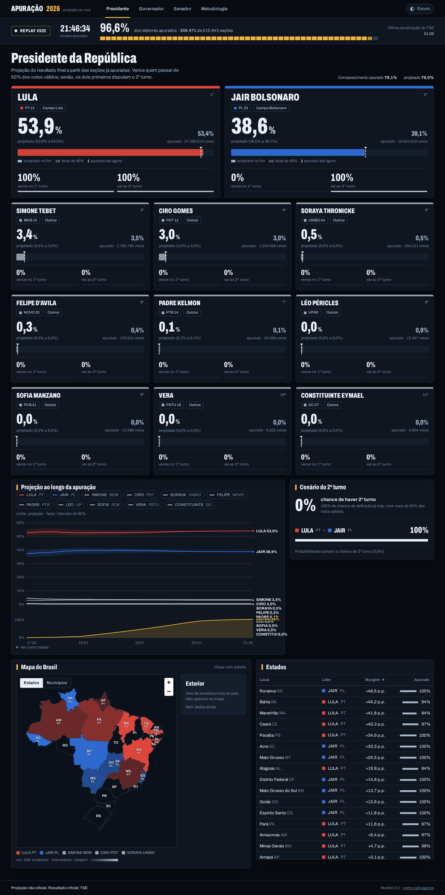
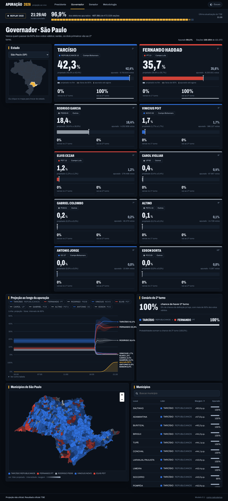
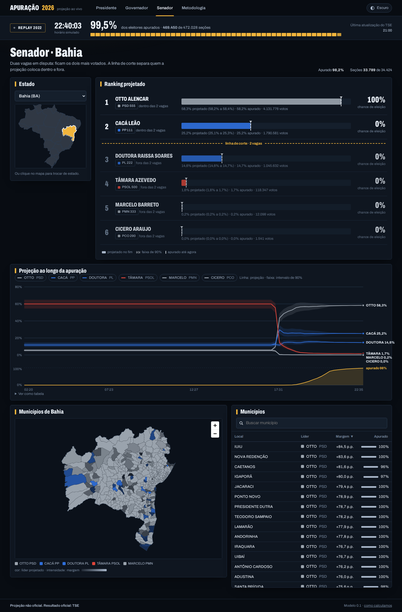
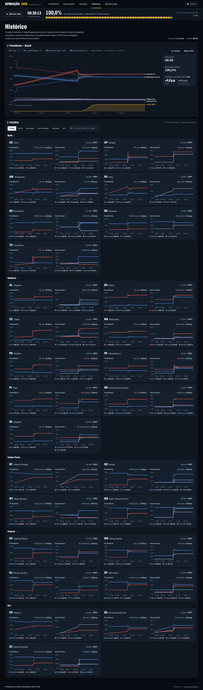

# 🗳️ projTurno1-2026

**Projeção em tempo real do 1º turno das eleições brasileiras de 2026** (Presidente, Governador e Senador), construída para a noite de 4 de outubro de 2026.

O TSE divulga os resultados aos poucos, e **a contagem parcial engana**: as urnas chegam fora de ordem, por região e porte do município, então "quem está na frente agora" nem sempre é quem vence. Este projeto lê os dados do TSE conforme saem, corrige esse viés de ordem de chegada e projeta o resultado final **com intervalo de confiança**, num painel com mapa do Brasil.

> ⚠️ **Projeção não oficial**, gerada por modelo estatístico. O resultado oficial é o do [TSE](https://resultados.tse.jus.br). Sem vínculo com o TSE.

<p align="center"></p>

*As imagens deste repositório são do **replay da eleição de 2022** (o mesmo código, alimentado com a chegada real das urnas de 2022).*

## O que ele faz

- 📡 **Lê o TSE ao vivo** (arquivos `-u.json` de BR, UF e município) com um cliente educado: taxa adaptativa, ETag, recuo automático em HTTP 429 e prioridade para os municípios mais defasados e maiores.
- 🧮 **Projeta o resultado final** por município, com Monte Carlo para o intervalo de 90%, probabilidade de 2º turno (Presidente e Governador) e de eleição (Senado, top-2).
- 🗺️ **Mapa do Brasil** (MapLibre) por UF e município, com o Exterior numa caixa à parte.
- 📸 **Histórico a cada 5 minutos**: uma "foto" da % realmente apurada e da % projetada, para ver as duas **convergindo** ao longo da noite (nacional + cada estado).
- 🔁 **Replay de 2022** e um "TSE falso" local para ensaiar a noite inteira sem bater no TSE.

| Governador | Senador | Histórico |
|---|---|---|
|  |  |  |

## Como o modelo funciona

1. **Unidade:** o município (5.570 + países do exterior), com os eleitores aptos e o comparecimento esperado.
2. **O que falta apurar** em cada município vem de uma regressão regularizada (ridge) dentro de cada UF, ancorada numa **eleição anterior** (Presidente de 2022 por município) e em um prior por *campo político* dos candidatos. O modelo **é agnóstico ao candidato**: aprende com o que já foi apurado, então funciona com candidatos novos.
3. **Incerteza:** Monte Carlo com um choque comum nacional, um por UF e um por município, mais a incerteza do volume de votos remanescente.
4. **Regras:** maioria absoluta dos válidos (Presidente e Governador); Senado em 2026 tem **2 vagas por UF** (voto duplo), então o ranking é top-2.

### Validação (backtest com a chegada real das urnas de 2022)

| Cenário | Resultado |
|---|---|
| Presidente, 3% a 97% apurado | erro médio **0,36 p.p.**; IC90 conteve o resultado final em **97%** das vezes |
| Governador (27 UFs), 50% apurado | erro médio **0,40 p.p.**; líder e 2º turno corretos em **100%** dos casos |
| Governador, 5% apurado | erro médio ~1,5 p.p. |

Detalhes e ressalvas em [`docs/backtest.md`](docs/backtest.md). Em 2026 há candidatos novos e o Senado tem 2 votos por eleitor, então o desempenho pode diferir.

## Stack

**Node 24 + TypeScript** de ponta a ponta: Fastify (API + SSE), PostgreSQL, React + Vite, MapLibre GL. O motor de projeção é um pacote puro (`packages/model`), usado igualmente pelo backtest e pelo ao vivo.

```
apps/api        API Fastify, poller do TSE, replay, fotos de 5 em 5 min
apps/web        painel React (Presidente, Governador, Senador, Histórico, Metodologia)
packages/model  motor de projeção (ridge + Monte Carlo)
scripts/        ETL (2018/2022), backtest, TSE falso, utilitários
db/migrations   esquema do Postgres
docs/           API, backtest, runbook
```

## Como rodar

Pré-requisitos: Node 24, PostgreSQL e uma base `eleicoes2026`.

```bash
cp .env.example .env            # ajuste a conexão
npm install
for f in db/migrations/*.sql; do psql "$DATABASE_URL" -f "$f"; done

# dados-base (municípios, eleitorado, geometrias) e histórico para o prior/backtest
node scripts/01_municipio.mjs && scripts/02_eleitorado.sh && node scripts/03_geo.mjs
python3 scripts/etl-2022.py && node scripts/etl-2018.mjs
node scripts/fetch-candidatos-2026.mjs

# ao vivo (porta 3001) e web (porta 3000)
MODE=live npm run start -w @eleicao/api
npm run dev -w @eleicao2026/web
```

- Ensaio sem o TSE: `MODE=replay SPEED=200 npm run start -w @eleicao/api`.
- Backtest: `npx tsx scripts/backtest-all.ts 3` (governador) e `npx tsx scripts/backtest.ts 1` (presidente).
- Operação na noite da eleição: [`docs/RUNBOOK.md`](docs/RUNBOOK.md). Contrato da API: [`docs/API.md`](docs/API.md).

## Boas práticas com o TSE

O portal do TSE limita requisições por IP (HTTP 429, com bloqueio de minutos). O poller começa a ~20 req/s, sobe até ~60 req/s e **recua sozinho** se levar um 429. Não rode varreduras paralelas do mesmo IP.

Os dados são do [TSE](https://dadosabertos.tse.jus.br) e as malhas geográficas do [IBGE](https://www.ibge.gov.br).
